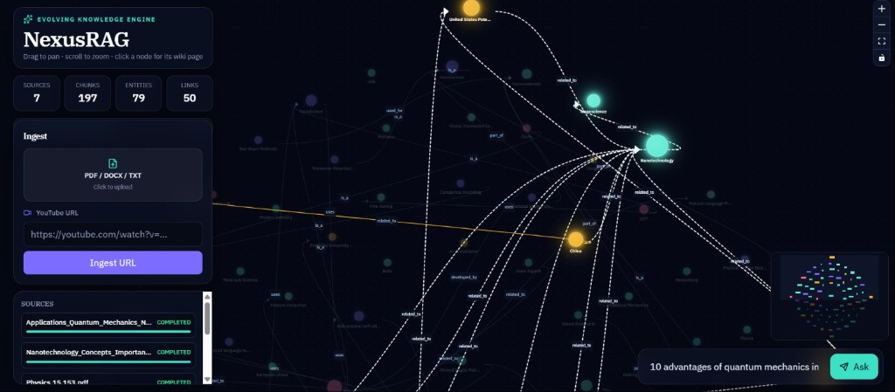
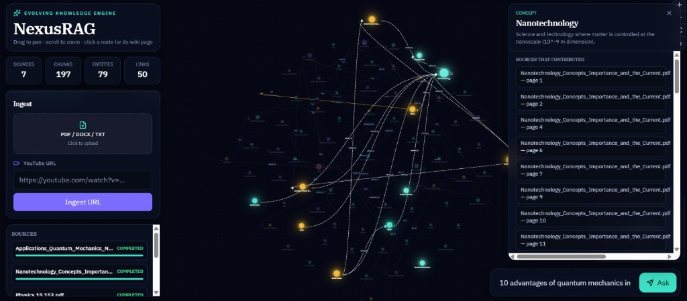
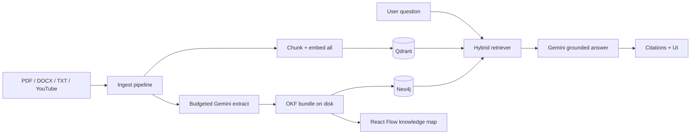

# NexusRAG

**Hybrid knowledge-graph RAG** that turns PDFs and transcripts into a persistent [OKF](https://github.com/GoogleCloudPlatform/knowledge-catalog/blob/main/okf/SPEC.md) knowledge map, then answers with **vector + graph** retrieval and page-level citations.

[](https://www.python.org/)
[](https://fastapi.tiangolo.com/)
[](https://react.dev/)
[](https://qdrant.tech/)
[](https://neo4j.com/)
[](https://ai.google.dev/)
[](LICENSE)

> Portfolio / resume project — designed to show end-to-end RAG engineering beyond “chunk → embed → chat.”

## Demo

Interactive knowledge map with ingest, hybrid Q&A, and click-to-inspect concept pages (page-level provenance).





---

## Resume highlights

Copy-ready bullets for a CV or LinkedIn:

- Built an **evolving knowledge-graph RAG** system that merges entities across documents into a durable OKF knowledge bundle (not one-shot chat over isolated chunks).
- Implemented **hybrid retrieval** combining Qdrant dense search with Neo4j graph neighborhood expansion for multi-hop, citation-backed answers.
- Designed a **cost-aware ingest pipeline**: embed all chunks, sample a budgeted subset for Gemini entity/relation extraction.
- Delivered a **React Flow** knowledge-map UI with entity detail panels, provenance (page / source), and grounded Q&A.

---

## Problem → solution

| Typical RAG | NexusRAG |
|-------------|----------|
| Each upload is a silo of chunks | Knowledge **accumulates** across sources |
| No shared entity identity | Concepts merge via title / alias resolution |
| Answers cite blobs of text | Answers cite **page / source** provenance |
| Graph is optional decoration | Graph is a first-class retrieval signal |

---

## Architecture



More detail: [`docs/ARCHITECTURE.md`](docs/ARCHITECTURE.md) · [`docs/SETUP.md`](docs/SETUP.md)

---

## Features

- **Multi-format ingest** — PDF, DOCX, TXT, YouTube transcripts  
- **OKF v0.2 knowledge bundle** — markdown + YAML concepts with links and provenance  
- **Entity resolution** — same concept across docs merges into one node  
- **Hybrid RAG** — vector hits + graph neighbors + list-aware second pass  
- **Page-level citations** — grounded answers tied back to sources  
- **Interactive graph UI** — pan/zoom map, click a node for OKF body / sources / links  
- **Local infra** — Qdrant + Neo4j via Docker Compose  

---

## Tech stack

| Layer | Choice |
|-------|--------|
| Frontend | React 19, Vite, Tailwind CSS 4, React Flow |
| Backend | FastAPI, Pydantic Settings |
| LLM / embeddings | Google Gemini (`gemini-3.5-flash`, `gemini-embedding-2`) |
| Vector store | Qdrant |
| Graph store | Neo4j 5 |
| Knowledge format | OKF v0.2 (file-backed bundle) |

---

## Repository layout

```
NexusRAG/
├── backend/app/          # FastAPI: ingest, OKF, hybrid RAG, graph API
│   ├── api/              # upload, query, graph routes
│   ├── ingestion/        # extractors, pipeline, smart sampler
│   ├── graph/            # entity extract + Neo4j sync
│   ├── okf/              # OKF bundle I/O
│   └── rag/              # Gemini, embeddings, retriever
├── frontend/src/         # React knowledge-map + chat overlays
├── data/                 # sample corpus (uploads/bundle gitignored)
├── docs/                 # architecture + assets
├── scripts/              # one-command local runners
├── docker-compose.yml    # Qdrant + Neo4j
└── .env.example
```

---

## Quick start

**Prerequisites:** Python 3.10+, Node 20+, Docker Desktop, [Gemini API key](https://aistudio.google.com/apikey)

```powershell
git clone https://github.com/phoenix191919/NexusRAG.git
cd NexusRAG

copy .env.example .env
# Edit .env → set GEMINI_API_KEY

docker compose up -d

python -m venv .venv
.\.venv\Scripts\Activate.ps1
pip install -r backend\requirements.txt

cd frontend
npm install
cd ..
```

**Run API** (terminal 1):

```powershell
.\scripts\start-backend.ps1
```

**Run UI** (terminal 2):

```powershell
.\scripts\start-frontend.ps1
```

Open **http://127.0.0.1:5173** — API docs at **http://127.0.0.1:8000/docs**

Try the bundled sample: upload `data/sample_bert.txt`, ask *“How does BERT differ from GPT?”*, then click entities on the map.

---

## API surface

| Method | Path | Purpose |
|--------|------|---------|
| `POST` | `/api/sources/upload` | PDF / DOCX / TXT |
| `POST` | `/api/sources/youtube` | `{ "url": "..." }` |
| `GET` | `/api/sources` | Ingestion status |
| `POST` | `/api/query` | `{ "question": "..." }` |
| `GET` | `/api/graph` | Link graph for UI |
| `GET` | `/api/graph/entity/{id}` | OKF concept detail |
| `GET` | `/api/stats` | Entity / source counts |
| `GET` | `/api/health` | Health check |

---

## What stays private

These paths are gitignored so demos and keys never hit GitHub:

- `.env` — API keys  
- `*.pdf` — your documents  
- `data/uploads/`, `data/bundle/`, `data/sources.json` — runtime knowledge  

---

## License

MIT — see [LICENSE](LICENSE).
